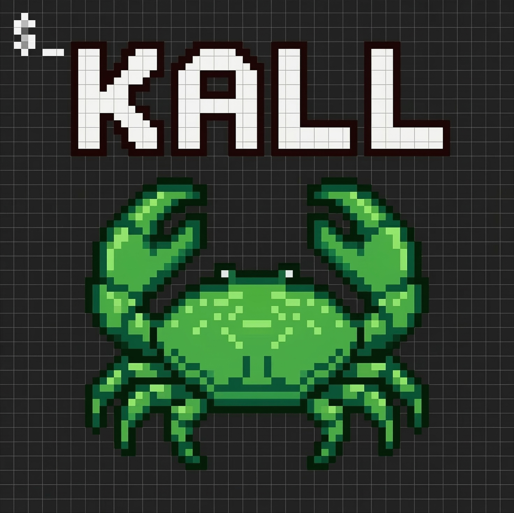

<p align="center">
  
</p>

<h1 align="center">kall</h1>

<p align="center">Run commands across multiple projects in parallel, with per-project aliases.</p>

```
 ▸ FE ✓ │ BE ○
──────────────────────────────────────────────
 Compiled successfully.

 ← → switch · x kill · 1/2 done
```

Output streams live into an interactive tab UI — use arrow keys to switch, `r` to rerun, `x` to kill.

## Install

### Homebrew (macOS and Linux)

```bash
brew tap kanetran29/tap
brew install kall
```

### From source

Requires [Go 1.22+](https://go.dev/dl/).

```bash
git clone https://github.com/kanetran29/kall.git
cd kall
make install
```

## Quick start

```bash
cd ~/workspace        # parent directory of your projects

kall init             # interactive picker — select which projects to manage
kall ls               # run 'ls' in every project
kall git status       # run any command across all projects
```

## Tab UI

When running in a terminal, kall shows an interactive tab view:

| Key | Action |
|-----|--------|
| `← →` | Switch between project tabs |
| `r` | Rerun the active tab's command |
| `x` | Kill the active tab's running process |
| `q` / Esc / Ctrl+C | Quit |

Tabs appear immediately with **○** (running) and update to **✓**/**✗** as commands finish. Output streams in real-time.

When piped (e.g. `kall git status | cat`), output falls back to plain sequential text.

## Aliases

Different projects often need different commands for the same task. Aliases let you unify them:

```bash
kall alias frontend start "yarn start"
kall alias backend start "flask run"

kall start            # runs the right command in each project
kall start --port 3000   # extra args are appended
```

Use `-V` to see what actually runs in each project:

```bash
kall -V start
# frontend → $ yarn start
# backend  → $ flask run
```

## Configuration

`kall init` creates a `.kall` file in the current directory. The format is INI-style:

```ini
[_settings]
shell = /bin/zsh                  # default shell for all commands
concurrency = 4                   # max parallel jobs (piped mode)
exclude = node_modules, dist      # hide from kall init

[*]
test = npm test                   # global alias — applies to all projects
lint = npm run lint

[frontend]
label = FE                        # short name for tabs
dir = src/app                     # subdirectory to run commands in
shell = /bin/bash                 # per-project shell override
env.PORT = 3000                   # environment variable
env.HOST = localhost
start = yarn start                # command alias
test = yarn test                  # overrides [*] global alias

[backend]
label = BE
env.FLASK_ENV = development
start = flask run
```

### Sections

- **`[_settings]`** — Global kall settings (shell, concurrency, exclude)
- **`[*]`** — Global aliases that apply to all projects (overridable per-project)
- **`[name]`** — Project directory name, with aliases and per-project config

### Per-project keys

| Key | Example | Description |
|-----|---------|-------------|
| `label` | `FE` | Display name for tabs (defaults to directory name) |
| `dir` | `src/app` | Subdirectory to run commands in |
| `shell` | `/bin/bash` | Shell override for this project |
| `env.KEY` | `env.PORT = 3000` | Environment variable |
| anything else | `start = yarn start` | Command alias |

kall finds `.kall` by walking up from the working directory (like `.git`), so you can run it from any subdirectory.

## Commands

```
kall init                          → Scan and select projects
kall config                        → Re-select projects
kall list                          → List configured projects
kall alias <project> <name> <cmd>  → Set a command alias
kall aliases                       → List all aliases
kall <command> [args]              → Run across all projects
kall completion <shell>            → Generate shell completions
kall -V <command>                  → Run with verbose (show resolved commands)
kall --version                     → Show version
```

## Shell completions

Homebrew installs completions automatically. For manual setup:

```bash
# Bash
kall completion bash > /usr/local/share/bash-completion/completions/kall

# Zsh
kall completion zsh > "${fpath[1]}/_kall"

# Fish
kall completion fish > ~/.config/fish/completions/kall.fish

# PowerShell
kall completion powershell | Out-File kall.ps1
```

## Uninstall

```bash
brew uninstall kall
# or
make uninstall
```

## License

[MIT](LICENSE)
